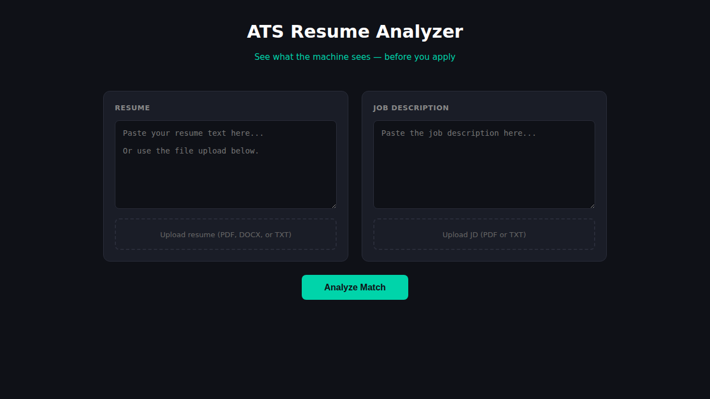
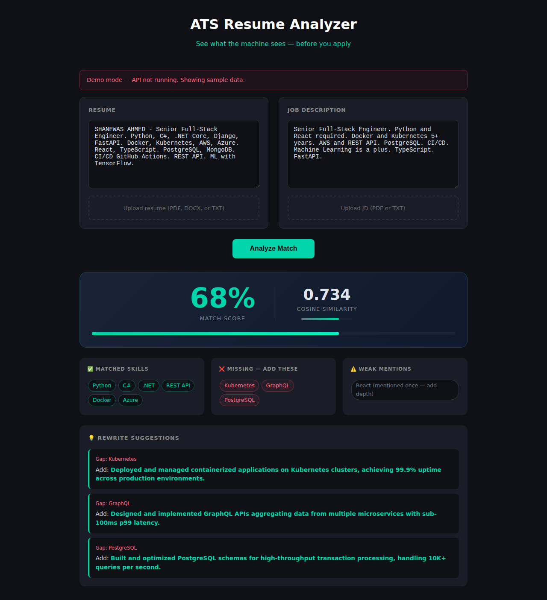

# ATS Resume Analyzer

Drop your resume and a job description in, get back a match percentage, find what you're missing, and see exactly what to fix.

**Use it:** https://atsresume.duckdns.org/ats/ui

---

## What this is

I built this because I kept applying to jobs and not knowing if my resume actually matched what they wanted. The idea is simple: paste the job description, paste your resume, let the tool tell you what's there and what's not.

It gives you:
- A match score (percentage of required skills that show up in your resume)
- Cosine similarity via TF-IDF — a weighted similarity measure, separate from the raw percentage
- A list of skills the job wants that you didn't mention
- Phrases you can use to fill each gap

It also parses uploaded files: PDF, DOCX, and TXT work. It pulls out your skills, years of experience, education, soft skills, and any certifications.

---

## How to run

**Docker:**

```bash
docker build -t ats-analyzer .
docker run -d -p 8001:8000 ats-analyzer
# then open http://localhost:8001/ui
```

**Locally:**

```bash
pip install -r requirements.txt
python src/main.py
```

---

## API examples

**Analyze from the command line:**

```bash
curl -X POST http://localhost:8001/analyze \
  -H "Content-Type: application/json" \
  -d '{
    "resume_text": "Python Django React AWS Docker PostgreSQL",
    "job_description_text": "Python Django React AWS Kubernetes Terraform PostgreSQL"
  }'
```

You get back something like:

```json
{
  "match_score": 63,
  "cosine_similarity": 0.5891,
  "matched_skills": ["AWS", "Django", "PostgreSQL", "Python", "React"],
  "missing_skills": ["Docker", "Kubernetes", "Terraform"],
  "suggestions": [
    {
      "gap": "Kubernetes",
      "suggested_phrase": "Deployed containerized apps on Kubernetes with rolling zero-downtime updates."
    }
  ]
}
```

**Parse a resume file:**

```bash
curl -X POST http://localhost:8001/upload/resume \
  -F "file=@resume.pdf"
```

Returns skills, experience, education, soft skills, certifications, and a raw text preview.

---

## How the scoring works

Skills mentioned in the Skills section carry 1.5x weight. Experience section gets 1.2x. Education gets 0.5x. If you mention a skill more than once, it gets a 1.3x frequency multiplier.

Soft equivalences are baked in: `.NET Core` counts as `.NET`, `NestJS` counts as `Node.js`, `K8s` as `Kubernetes`, and so on.

Cosine similarity uses TF-IDF vectors from the skill sets — it captures something different from the plain percentage, so both numbers are useful.

---

## Tests

```bash
PYTHONPATH=src python -m pytest tests/test_pipeline.py -v
```

22 tests, all passing.

---

## Screenshots

### Blank UI, ready to use



### After running an analysis



---

## Project layout

```
ats-resume-analyzer/
├── src/
│   ├── main.py
│   └── models.py
├── mocks/
│   └── index.html
├── tests/
│   └── test_pipeline.py
├── screenshots/
├── Dockerfile
├── requirements.txt
└── README.md
```

Made for personal use. Not affiliated with any ATS vendor.
